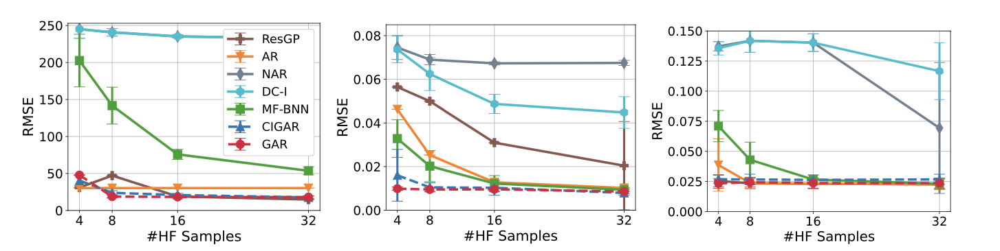
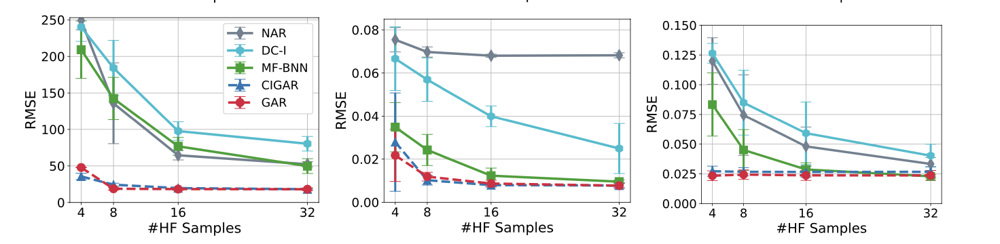

## Experiment Module

In this section, we provide the experiments code for figures for some FF model. The codes are divided by different experiment settings.

### FF Aligned
The contents of this folder are related to experiments on aligning data. After you run the code by different methods, the results will stored in 'exp_results' folder. Then you can run the 'pic_aligned_data.py' to generate targeted figures.

    

### FF Non Aligned
The contents of this folder are related to experiments on non-aligning data. After you run the code by different methods, the results will stored in 'exp_results' folder. Then you can run the 'pic_non_aligned_data.py' to generate targeted figures.

    

### FF Non Subset
The contents of this folder are related to experiments on non-subset data.  After you run the code by different methods, the results will stored in 'exp_results' folder. Then you can run the 'pic_non_subset_data.py' to generate targeted figures.

    

### CAR Subset
Codes in this folder are responsible for the Figure 2 and Figure 5 top row in CAR. After you run the code by different methods, the results will stored in 'exp_results' folder. Then you can run the 'pic_subset.py' to generate targeted figures.

### CAR Non Subset
Codes in this folder are responsible for the Figure 3 and Figure 5 second row in CAR. After you run the code by different methods, the results will stored in 'exp_results' folder. Then you can run the 'pic_non_subset.py' to generate targeted figures.

### FF Non Subset
Codes in this folder are responsible for the Figure 6 in CAR. After you run the code by different methods, the results will stored in 'exp_results' folder. Then you can run the 'pic_cost.py' to generate targeted figures.