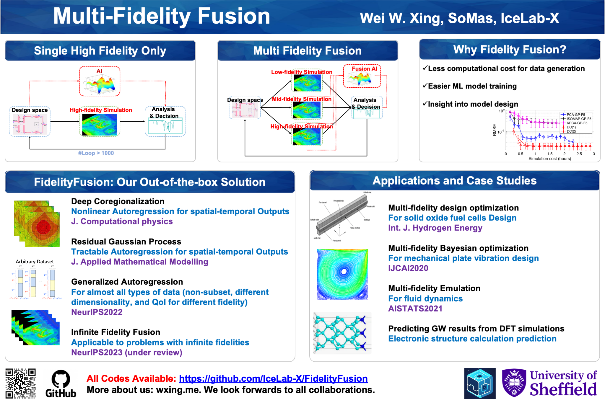
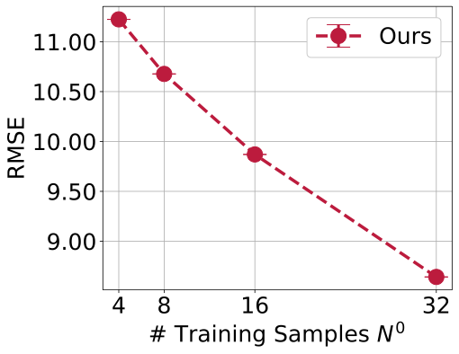

# FidelityFusion

FidelityFusion is a library for data-driven surrogate model with multi-fidelity data, which can be easily generated by adjusting the simulation setup (such as mesh size, time step, etc.).

By leveraging the multi-fidelity data, the surrogate model can be trained with many low-fidelity data, which is cheap to generate, and a few high-fidelity data to predict the output of the high-fidelity simulation accurately.

FidelityFusion focus on tractable multi-fidelity fusion methods, which can be easily optimized and scaled to high-dimensional output with strong generalization and robustness.

<!-- In many scientific research and engineering applications where repeated simulations of complex systems are conducted, a surrogate is commonly adopted to quickly estimate the whole system. To reduce the expensive cost of generating training examples, it has become a promising approach to combine the results of low-fidelity (fast but inaccurate) and high-fidelity (slow but accurate) simulations. Despite the fast developments of multi-fidelity fusion techniques, most existing methods require particular data structures and do not scale well to high-dimensional output. To resolve these issues, we generalize the classic autoregression (AR), which is wildly used due to its simplicity, robustness, accuracy, and tractability, and propose generalized autoregression (GAR) using tensor formulation and latent features. GAR can deal with arbitrary dimensional outputs and arbitrary multi- fidelity data structure to satisfy the demand of multi-fidelity fusion for complex problems; it admits a fully tractable likelihood and posterior requiring no approxi- mate inference and scales well to high-dimensional problems. Furthermore, we prove the autokrigeability theorem based on GAR in the multi-fidelity case and develop CIGAR, a simplified GAR with the exact predictive mean accuracy with computation reduction by a factor of $ d^3 $ , where $ d $  is the dimensionality of the output. The empirical assessment includes many canonical PDEs and real scientific examples and demonstrates that the proposed method consistently outperforms the SOTA methods with a large margin (up to 6x improvement in RMSE) with only a couple high-fidelity training samples. -->

**FidelityFusion includes the following algorithms:**
- [AR0](https://www.jstor.org/stable/2673557): the classic autoregression  model by M. C. Kennedy and A. O'Hagan. `Tractable model` applicable to `single-output` and `subset-structured` multi-fidelity data.

- [NAR](https://royalsocietypublishing.org/doi/10.1098/rspa.2016.0751): the classic nonstationary autoregression model by G. E. Karniadakis' team. 
`Nontractable model` applicable to `single/low-dimensional-output` and `subset-structured` multi-fidelity data.

- [DC](https://www.sciencedirect.com/science/article/pii/S0021999120307580): Deep Coregionalization. `Nontractable model` applicable to `high-dimensional-output`/`spatial-temporal field output`, and `subset-structured` multi-fidelity data.

- [ResGP](https://www.sciencedirect.com/science/article/pii/S0307904X21001724): Residual Gaussian Process. `Tractable model` applicable to `high-dimensional-output`/`spatial-temporal field output`, and `subset-structured` multi-fidelity data.

- [GAR](https://openreview.net/forum?id=aLNWp0pn1Ij) [[Slides](https://nips.cc/media/neurips-2022/Slides/55046_uubcAyK.pdf)]: Generalized autoregression model. Possibly the most powerful `Tractable model` applicable to `high-dimensional-output`/`spatial-temporal field output` that are `nonaligned`(the dimensionality is different at different fidelities), and `arbitrary-structured` multi-fidelity data.

- [CIGAR](https://openreview.net/forum?id=aLNWp0pn1Ij) [[Slides](https://nips.cc/media/neurips-2022/Slides/55046_uubcAyK.pdf)]: 
Conditional independent generalized autoregression.
A simplified version of GAR by leveraging the *Autokrigeability*. `Tractable model` applicable to `ultra-high-dimensional-output`/`spatial-temporal field output` that are `nonaligned`(the dimensionality is different at different fidelities), and `arbitrary-structured` multi-fidelity data.


<!--   -->
<!--  -->
<!--  -->
<!-- <p align="center"> -->
  <!--  -->
<!-- </p> -->
<p align="center">
  
</p>

 <!-- less high-fidelity data, which is expensive to generate. The surrogate model can be used to predict the output of the high-fidelity simulation. -->
 <!-- It is developed based on the [GAR](https://openreview.net/forum?id=aLNWp0pn1Ij) method, which is a generalized autoregression model for multi-fidelity fusion. FidelityFusion is designed to be easy to use and easy to extend. It is built on top of [PyTorch](https://pytorch.org/) and [GPyTorch](https://gpytorch.ai/), and is intended to enable fast and flexible experimentation with multi-fidelity fusion models. FidelityFusion is developed by [IceLab-X](https://imshibo.com) and [W. W. Xing](http://wxing.me) at [Beihang University](https://ev.buaa.edu.cn/), and [Mike Kirby](https://www.cs.utah.edu/~kirby/) and [Shandian Zhe](https://www.cs.utah.edu/~zhe/) at [University of Utah](https://www.utah.edu/). -->


 <!-- scientific machine learning and physics-informed learning.  -->

<!-- by [Zen Xing](https://imshibo.com), [W. W. Xing](http://wxing.me),  -->
<!-- [Mike Kirby](https://www.cs.utah.edu/~kirby/) and [Shandian Zhe](https://www.cs.utah.edu/~zhe/) -->


# Packaging and Installing
Packaging software：
```
# create "tar.gz" compressed file
python setup.py sdist
The generated compressed file will be saved to：dist/mffusion-0.1.0b1.tar.gz

# create "whl" compressed file
python setup.py bdist_wheel 
The generated compressed file will saved in to：dist/mffusion-0.1.0b1-py3-none-any.whl
```

For user (who do not want to modify the code), install `mffusion`：
```
pip install mffusion-0.1.0b1.tar.gz
```

For developer, install `mffusion`：
```
cd mffusion (Navigate to the setup.py)
pip install -e .
```

<!-- # Datasets
Here we put the toydata as a sample to run demos. But you can also use the other dataset we mentioned in the papers. Like Burger’s, Poisson’s, Heat equations, Topology Optimization and Plasmonic nanoparticle arrays.
```
mffusion/
├── data/
│     └── sample/
│           └──...
``` -->

# Run
You can fast test on toy data by run `gar_demo.py`. You will be able find all the demo results in `mffusion/demo/`. 
```
mffusion/
├── demo/
│     └── gar_demo.py
├── visualize_tools/
│     └── paint_code/
│              └── subset/
│                    └── paint_seed.py/
```
<!-- For training samples num increased from 4 to 32, the testing errors are ploted in the following graph. The generated graph will be sotred in `mffusion/graph`. -->

<!-- <p align = "center">
    <br>
    
    <br>
<p> -->


# Contributing to FidelityFusion 
- **Reporting bugs.** To report a bug, simply open an issue in the GitHub [Issues](https://github.com/IceLab-X/FidelityFusion/issues).
- **Suggesting enhancements.** To submit an enhancement suggestion, including completely new features or minor improvements on existing features, please open an issue in the GitHub [Issues](https://github.com/IceLab-X/FidelityFusion/issues).
- **Pull requests.** If you made improvements to FidelityFusion, fixed a bug, or had a new example, feel free to send us a pull-request.
- **Asking questions.** To get help on how to use FidelityFusion or its functionalities, you can open a discussion in the GitHub.
<!-- - **Answering questions.** If you know the answer to any question in the [Discussions](https://github.com/lululxvi/deepxde/discussions), you are welcomed to answer. -->
<!-- - **Asking questions.** To contact us, never hesitate to send an email to `wayne.xingle@gmail.com`. -->

<!-- # Getting Involved
Feel free to submit Github issues or pull requests. Welcome to contribute to our project! -->

## The Team
FidelityFusion was developed and maintained by mainly by  [Wei. W. Xing](http://wxing.me) at [IceLab-X](https://icelab-x.github.io) and [Zen Xing](https://github.com/zen-xingle) at Rockchips.
A non-exhaustive but growing list needs to mention: [Yuxing Wang]() and [Guanjie Wang]() at BUAA.

<!-- DeepXDE was developed by [Lu Lu](https://lu.seas.upenn.edu) under the supervision of Prof. [George Karniadakis](https://www.brown.edu/research/projects/crunch/george-karniadakis) at [Brown University](https://www.brown.edu) from the summer of 2018 to 2020, supported by [PhILMs](https://www.pnnl.gov/computing/philms). DeepXDE was originally self-hosted in Subversion at Brown University, under the name SciCoNet (Scientific Computing Neural Networks). On Feb 7, 2019, SciCoNet was moved from Subversion to GitHub, renamed to DeepXDE.

DeepXDE is currently maintained by [Lu Lu](https://lu.seas.upenn.edu) at [University of Pennsylvania](https://www.upenn.edu) with major contributions coming from several talented individuals in various forms and means. A non-exhaustive but growing list needs to mention: [Zongren Zou](https://github.com/ZongrenZou), [Zhongyi Jiang](https://github.com/Jerry-Jzy), [Shunyuan Mao](https://github.com/smao-astro), [Paul Escapil-Inchauspé](https://github.com/pescap). -->

## License
[LGPL-2.1 License](https://github.com/lululxvi/deepxde/blob/master/LICENSE)

# Citation
Please cite our paper if you find it helpful :) 

```
@inproceedings{
wang2022gar,
title={{GAR}: Generalized Autoregression for Multi-Fidelity Fusion},
author={Yuxin Wang and Zheng Xing and WEI W. XING},
booktitle={Advances in Neural Information Processing Systems},
editor={Alice H. Oh and Alekh Agarwal and Danielle Belgrave and Kyunghyun Cho},
year={2022},
url={https://openreview.net/forum?id=aLNWp0pn1Ij}
}

```