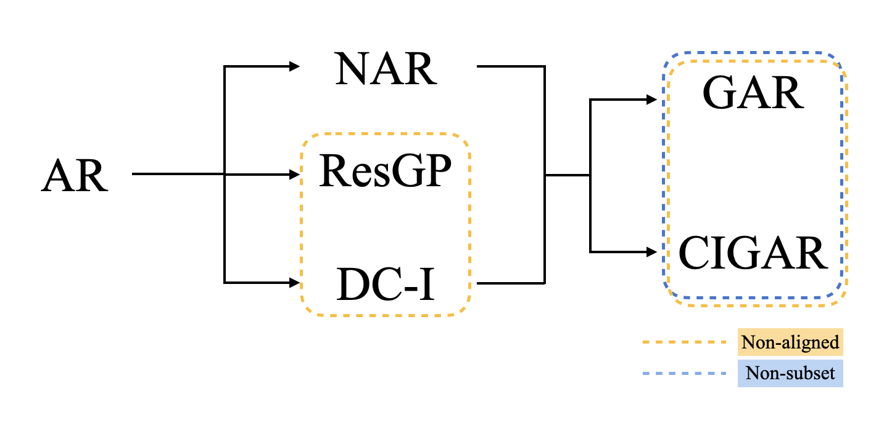

# *MF-Fusion*: Toolbox of most GP-based mtehod

by [Zen Xing](https://imshibo.com), [W. W. Xing](http://wxing.me), 
<!-- [Mike Kirby](https://www.cs.utah.edu/~kirby/) and [Shandian Zhe](https://www.cs.utah.edu/~zhe/) -->

<p align="center">
    <br>
    
    <br>
<p>

<h4 align="center">
    <p>
        <a href="https://openreview.net/forum?id=aLNWp0pn1Ij">Paper</a> |
        <a href="https://github.com/IceLab-X/FidelityFusion/blob/main/images/poster.pdf">Poster</a> 
        <!-- <a href="https://github.com/shib0li/Infinite-Fidelity-Coregionalization/blob/main/images/slides.pdf">Slides</a> |
        <a href="https://github.com/shib0li/Infinite-Fidelity-Coregionalization/blob/main/images/poster.pdf">Poster</a>  -->
    <p>
</h4>


In many scientific research and engineering applications where repeated simu- lations of complex systems are conducted, a surrogate is commonly adopted to quickly estimate the whole system. To reduce the expensive cost of generating training examples, it has become a promising approach to combine the results of low-fidelity (fast but inaccurate) and high-fidelity (slow but accurate) simulations. Despite the fast developments of multi-fidelity fusion techniques, most existing methods require particular data structures and do not scale well to high-dimensional output. To resolve these issues, we generalize the classic autoregression (AR), which is wildly used due to its simplicity, robustness, accuracy, and tractability, and propose generalized autoregression (GAR) using tensor formulation and latent features. GAR can deal with arbitrary dimensional outputs and arbitrary multi- fidelity data structure to satisfy the demand of multi-fidelity fusion for complex problems; it admits a fully tractable likelihood and posterior requiring no approxi- mate inference and scales well to high-dimensional problems. Furthermore, we prove the autokrigeability theorem based on GAR in the multi-fidelity case and develop CIGAR, a simplified GAR with the exact predictive mean accuracy with computation reduction by a factor of $ d^3 $ , where $ d $  is the dimensionality of the output. The empirical assessment includes many canonical PDEs and real scientific examples and demonstrates that the proposed method consistently outperforms the SOTA methods with a large margin (up to 6x improvement in RMSE) with only a couple high-fidelity training samples.


# Packaging and Installing

Packaging software：
```
# create "tar.gz" compressed file
python setup.py sdist
The generated compressed file will saved in to：dist/mffusion-0.1.0b1.tar.gz

# create "whl" compressed file
python setup.py bdist_wheel 
The generated compressed file will saved in to：dist/mffusion-0.1.0b1-py3-none-any.whl
```

For user, install `mffusion`：
```
pip install mffusion-0.1.0b1.tar.gz
```

For developer, install `mffusion`：

```
cd mffusion (Navigate to the setup.py)
pip install -e .
```

# Datasets

Here we put the toydata as a sample to run demos. But you can also use the other dataset we mentioned in the paper. Like Burger’s, Poisson’s, Heat equations, Topology Optimization and Plasmonic nanoparticle arrays.

```
mffusion/
├── data/
│     └── sample/
│           └──...
```

# Run

You can fast test on toydata equation by run `gar_demo.py` and paint 
```
mffusion/
├── demo/
│     └── gar_demo.py
├── visualize_tools/
│     └── paint_code/
│              └── subset/
│                    └── paint_seed.py/
```
For training samples num increased from 4 to 32, the testing errors are ploted in the following graph. The generated graph will be sotred in `mffusion/graph`.

<p align = "center">
    <br>
    
    <br>
<p>


# License

IFC is released under the MIT License, please refer the LICENSE for details

# Getting Involved
Feel free to submit Github issues or pull requests. Welcome to contribute to our project!

To contact us, never hestitate to send an email to `wxin@buaa.edu.cn` or `wayne.xingle@gmail.com` 


# Citation
Please cite our paper if you find it helpful :) 

```
@inproceedings{
wang2022gar,
title={{GAR}: Generalized Autoregression for Multi-Fidelity Fusion},
author={Yuxin Wang and Zheng Xing and WEI W. XING},
booktitle={Advances in Neural Information Processing Systems},
editor={Alice H. Oh and Alekh Agarwal and Danielle Belgrave and Kyunghyun Cho},
year={2022},
url={https://openreview.net/forum?id=aLNWp0pn1Ij}
}

```
<br></br>